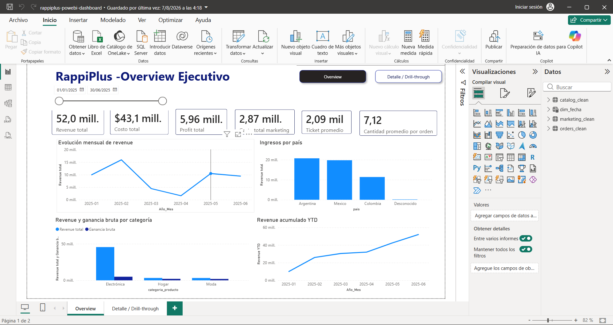
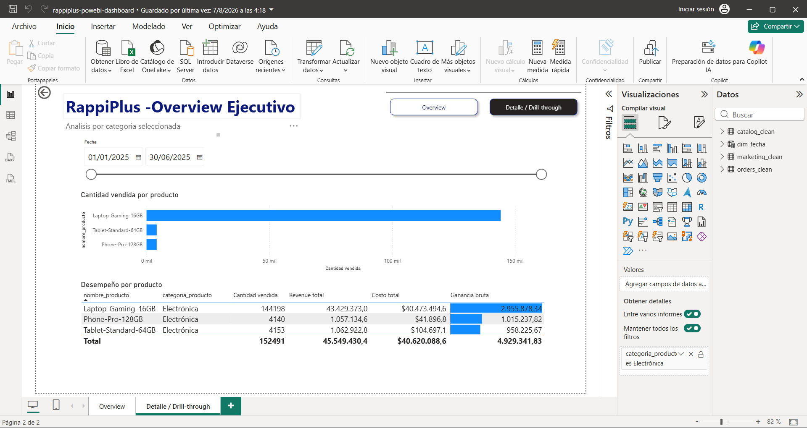
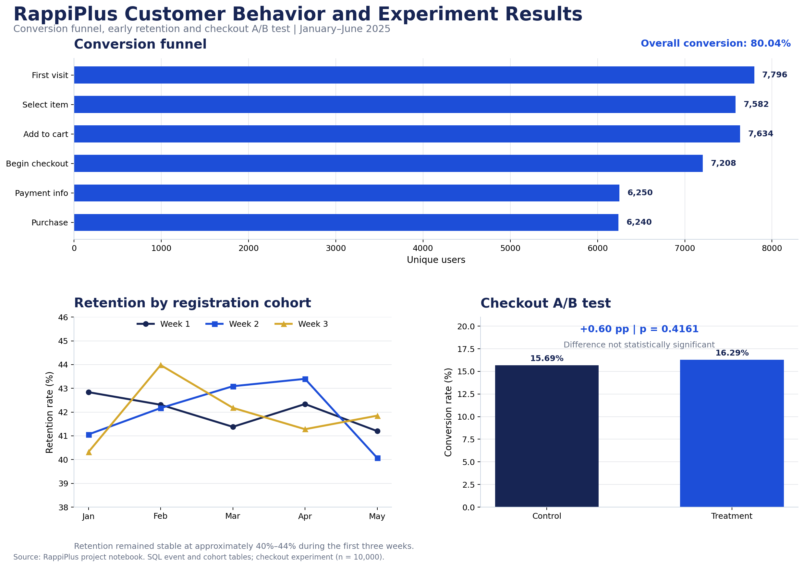

# RappiPlus Strategic Business Analysis

End-to-end e-commerce analysis developed with Python, SQL, statistics, and Power BI to connect commercial performance, marketing investment, customer behavior, and experimentation with business decisions.

## Project Overview

RappiPlus needed a unified view of profitability and customer performance. Transactional, product, marketing, behavioral, and experimental data were analyzed to determine whether the business was profitable, where users were lost in the purchase journey, whether customers remained active after registration, and whether a checkout redesign should be implemented.

The project moves from data validation to executive communication: Python was used to clean and validate the data, SQL to analyze the funnel and retention cohorts, a two-proportion Z-test to evaluate the checkout experiment, and Power BI to build an interactive commercial dashboard.

## Business Questions

- Can the available data be trusted for business decisions?
- Is RappiPlus profitable after product costs and marketing investment?
- Where are customers lost throughout the conversion funnel?
- How strong is customer retention during the first weeks after registration?
- Did the checkout treatment produce a statistically significant improvement?
- Which countries, categories, and products contribute most to commercial performance?

## Analytical Workflow

### 1. Data Quality and Preparation

- reviewed missing values, duplicates, invalid quantities, negative amounts, and date consistency
- standardized transactional, catalog, and marketing data
- reconciled order totals against quantity, unit price, and discounts
- exported clean datasets for the Power BI model

### 2. Profitability Analysis

- calculated revenue, product cost, gross profit, marketing investment, net profit, and margin
- measured average order value and average products per order
- analyzed commercial performance by country, category, and product

### 3. Customer Behavior and Experimentation

- built the conversion funnel with SQL event data
- evaluated weekly retention by registration cohort
- compared checkout variants with a two-proportion Z-test
- translated statistical results into an implementation recommendation

### 4. Business Intelligence

- created a calendar dimension and relational data model
- developed DAX measures for financial and commercial KPIs
- built executive and product-level Power BI views with filters, navigation, and drill-through

## Power BI Dashboard

### Commercial and Financial Overview

The executive view consolidates revenue, product costs, marketing investment, net profit, average order value, sales by country, category performance, and accumulated revenue.

<p align="center">
  
</p>

### Product Performance

The detail view makes it possible to compare sales volume, revenue, product cost, and gross profit at product level and supports category drill-through analysis.

<p align="center">
  
</p>

## Customer Behavior and Experimentation

The Power BI report contains the two pages shown above: `Overview` and `Detalle / Drill-through`. The following image is not a third Power BI page. It is a static portfolio summary created from the validated notebook results so the SQL conversion funnel, cohort retention, and A/B test can be reviewed directly on GitHub without specialized software.

<p align="center">
  
</p>

## Key Findings

- RappiPlus generated **$51.95M in revenue** and **$5.96M in net profit** after product costs and marketing investment.
- The resulting **net margin was 11.47%**, confirming profitability while showing the importance of protecting contribution margins.
- The complete conversion funnel reached **80.04%**, with the largest visible loss occurring before customers added payment information.
- Weekly retention remained approximately between **40% and 44%** across the analyzed cohorts, creating an opportunity to strengthen early engagement.
- The treatment checkout converted at **16.29%**, compared with **15.69%** for the control group, a difference of **+0.60 percentage points**.
- The experiment produced a **p-value of 0.4161**, so the observed improvement was not statistically significant and did not justify a global rollout.
- `Laptop-Gaming-16GB` was the highest-volume product with **144,198 units sold**, but its high revenue contribution must be evaluated together with product cost and gross profit.

## Business Recommendations

- maintain the current checkout experience until a new experiment provides stronger statistical evidence
- test a more substantial checkout change or increase the experiment duration and sample size
- design onboarding and activation initiatives focused on the first three weeks after registration
- monitor product costs and marketing investment to protect the positive net margin
- evaluate high-volume products through both revenue and contribution margin
- prioritize the countries, categories, and products with the strongest profitable growth potential

## Personal Voice and Learning

- I learned that revenue alone does not describe business performance. Product costs, marketing investment, customer behavior, and profitability must be evaluated together.
- A positive experimental result should not automatically become a business decision. Statistical evidence and commercial relevance must support the recommendation.
- This project strengthened my ability to connect technical analysis with Marketing Data Analytics decisions related to conversion, retention, investment, and product performance.

## Tools and Skills

- **Python and Pandas:** data cleaning, validation, aggregation, and KPI calculation
- **SQL and PostgreSQL:** conversion funnel and cohort-retention analysis
- **Statistics:** two-proportion Z-test for A/B experimentation
- **Power BI and DAX:** data modeling, measures, time intelligence, navigation, and drill-through
- **Business Intelligence:** profitability, customer behavior, marketing performance, and executive communication

## Repository Structure

```text
rappiplus-strategic-business-analysis/
├── dashboard/
│   └── rappiplus-power-bi-dashboard.pbix
├── datasets/
│   ├── catalog_clean.csv
│   ├── marketing_clean.csv
│   └── orders_clean.csv
├── images/
│   ├── 1_rappiplus-executive-overview.png
│   ├── 2_rappiplus-product-performance.png
│   └── 3_rappiplus-customer-behavior.png
├── rappiplus-strategic-business-analysis.ipynb
└── README.md
```

## File Guide

- `rappiplus-strategic-business-analysis.ipynb`: data preparation, profitability analysis, SQL queries, retention cohorts, and A/B testing
- `dashboard/rappiplus-power-bi-dashboard.pbix`: interactive Power BI report; download and open it with Power BI Desktop
- `datasets/`: cleaned transactional, catalog, and marketing data used by the dashboard
- `images/`: three portfolio-ready visualizations displayed in this README

## Reproducibility Note

Database credentials are not stored in this public repository. The SQL sections read connection values from the environment variables `DB_USER`, `DB_PASSWORD`, `DB_HOST`, `DB_PORT`, and `DB_NAME`.
